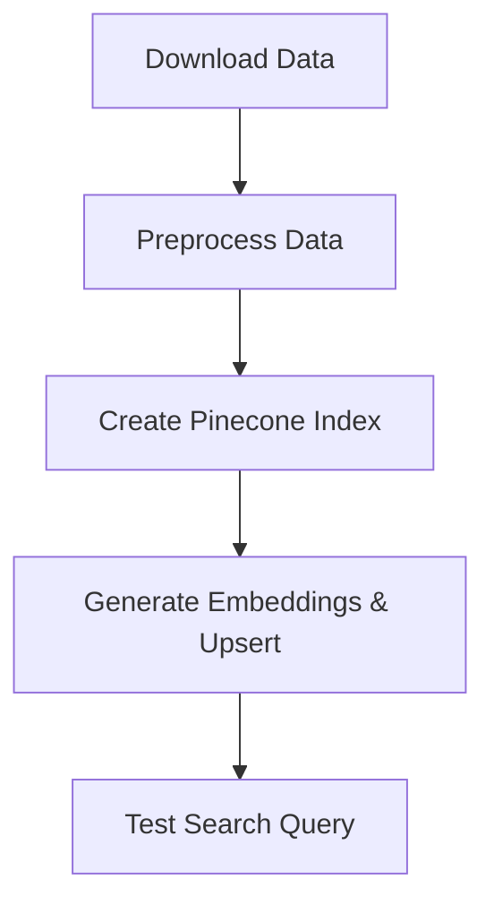

# 🔍 Semantic Search Pipeline with Airflow, Pinecone, and Sentence Transformers

This project builds a semantic search engine for Medium articles using **Pinecone** as the vector database, **Sentence Transformers** for embedding generation, and **Apache Airflow** for orchestration. Each step in the pipeline runs as an Airflow task and is fully containerized with Docker.

> ✅ Completed as part of an academic assignment focused on building vector-based semantic search engines using modern MLOps tooling.

---

## 🚀 Features

- Download Medium article dataset
- Clean, preprocess, and format metadata
- Generate sentence embeddings using `all-MiniLM-L6-v2`
- Create/reset a Pinecone index
- Batch upsert embeddings to Pinecone vector DB
- Perform semantic search for a given query
- Run all tasks inside **Apache Airflow** DAG
- Fully configured via `docker-compose.yaml`

---

## 🧰 Tech Stack

- 🧬 [Sentence Transformers](https://www.sbert.net/)
- 📦 [Pinecone](https://www.pinecone.io/)
- 📊 [Apache Airflow](https://airflow.apache.org/)
- 🐳 Docker & `docker-compose`
- 🐍 Python 3.10+

---


## ⚙️ Setup Instructions

### 1. Clone and Navigate

```bash
git clone https://github.com/Nak1106/semantic-search-pipeline.git
cd semantic-search-pipeline
```

### 2. Build and Start Airflow

```bash
docker compose down
docker compose up -d
```

Ensure `sentence-transformers` and `pinecone-client` are included in the `docker-compose.yaml`.

### 3. Configure Pinecone Access

Create an Airflow Variable in the UI:

- Variable Key: `pinecone_api_key`
- Variable Value: Your actual API key from Pinecone.io

---

## 🔄 DAG Flow



Each task logs its results in Airflow, including embedding output and vector search scores.

---

## 📈 Sample Query Output

```text
Search results for query: 'what is ethics in AI'
ID: 84, Score: 0.912, Title: Ethics in Machine Learning...
ID: 37, Score: 0.876, Title: Understanding AI and Morality...
...
```

---

## 📷 Screenshots

| Step | Screenshot |
|------|------------|
| DAG Overview | ✅ Captured in Airflow UI |
| Task Logs | ✅ Each task log included |
| Docker Compose Setup | ✅ Verified setup with sentence-transformers & Pinecone |

Place screenshots in a folder named `/screenshots`.

---

## 📚 Learning Outcomes

- Build an Airflow DAG with multiple NLP + MLOps tasks  
- Generate semantic embeddings using state-of-the-art models  
- Interact with a scalable vector DB (Pinecone)  
- Run real-time search against preprocessed article metadata  
- Dockerize your full Airflow pipeline for reproducibility  

---

## 👨‍💻 Author

**Nakshatra Desai**  
Graduate Student – MS Data Analytics @ SJSU  
📫 [LinkedIn](https://www.linkedin.com/in/nakshatra-desai-547a771b6/)

---
